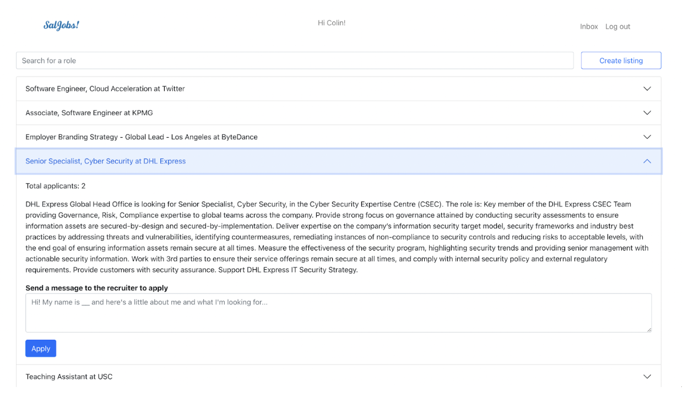

<!-- PROJECT LOGO -->
 

    
  <h3 align="center">
    SalJobs: A website that allows start-up companies to post job listings and for users to message the companies when they apply.
  </h3>

  

<!-- ABOUT THE PROJECT -->
## About The Project

SalJobs is an app that enables start-up companies to post job listings and for users to message the companies when they apply.

### Key Features
  - **Dashboard**: View all available job listings, descriptions, and apply to them by sending a message.
  - **Messages**: Chat with recruiters of jobs you applied to or the applicants of the jobs you posted in real time via websockets.
  - **Create**: Create a new job listing and receive job applications directly to your message inbox.

![Product Name Screen Shot][product-screenshot2]

## Built With

* Java
* Spring Boot
* MySQL
* SockJS
* React

<!-- MARKDOWN LINKS & IMAGES -->
<!-- https://www.markdownguide.org/basic-syntax/#reference-style-links -->
[product-screenshot1]: images/home.png
[product-screenshot2]: images/chat.png
